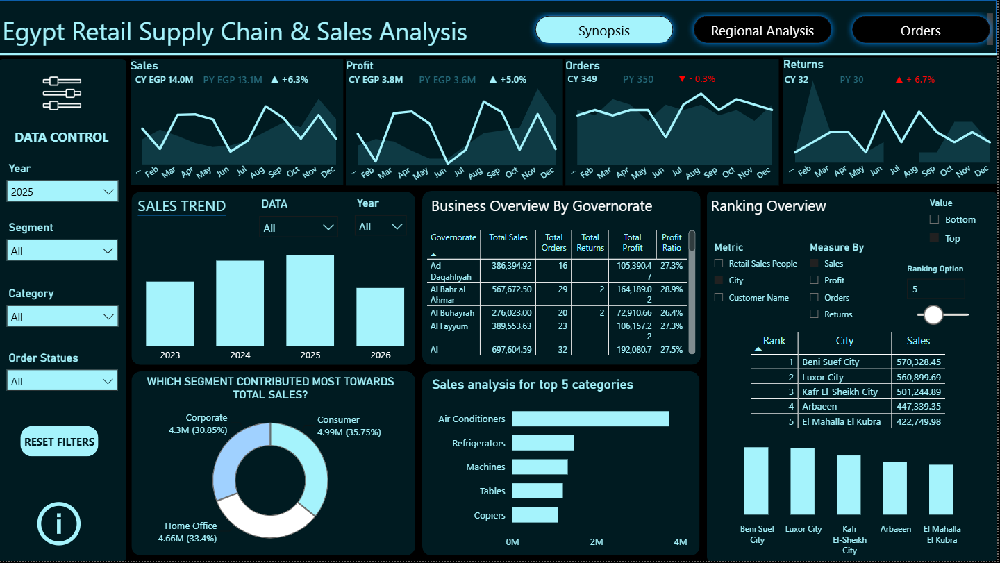
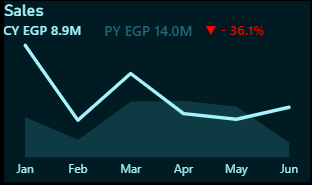
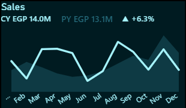
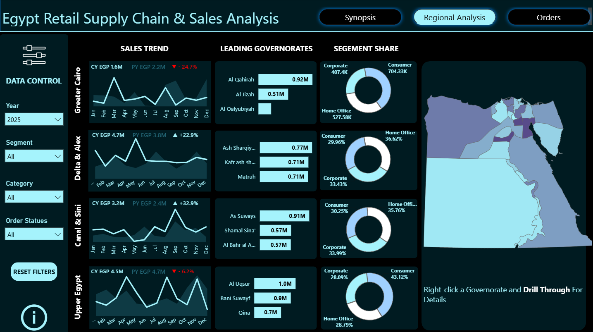
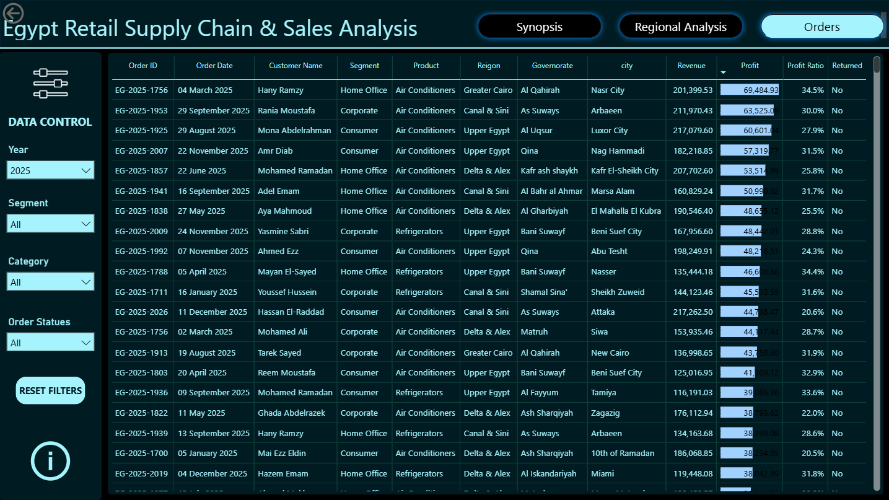

# Egypt Retail Supply Chain & Sales Analytics

A modern, interactive Power BI solution designed to analyze retail sales performance across Egypt through advanced [DAX calculations](docs/Dax_Documentation.md), dynamic report interactions, and intuitive business intelligence dashboards.

The project showcases production-ready Power BI development practices by combining custom Time Intelligence, Field Parameters, dynamic ranking, Drillthrough navigation, Bookmarks, and comprehensive DAX documentation within a reusable reporting template.



Python
    │
    ▼
Synthetic Dataset
    │
    ▼
Power Query (M)
    │
    ▼
Calendar Table
    │
    ▼
Data Model
    │
    ▼
DAX Architecture
    │
    ▼
Field Parameters
    │
    ▼
Interactive Report
    │
    ▼
PBIX + PBIT


## DAX Documentation

Every measure in this project follows a structured documentation format.

The documentation is designed to explain not only how each measure is implemented, but also the business reasoning behind every calculation.

```text
Purpose
Business Logic
DAX Formula
Dependencies
Used In
Technical Notes
```

### Example Measure:

```DAX
Growth_With_Icon =
VAR Growth = [Sales_Growth_%]

RETURN
IF(
    Growth >= 0,
    "▲ " & FORMAT(Growth, "+0.0%"),
    "▼ " & FORMAT(Growth, "0.0%")
)
```
Here is how the dynamic KPI cards automatically respond to performance changes, adjusting colors, indicators, and trends based on **Current Year (CY)** vs. **Previous Year (PY)** data:

| Negative Trend (Drop) | Positive Trend (Growth) |
| :---: | :---: |
|  |  |


The documentation currently covers every DAX measure used throughout the report, including Financial Metrics, Time Intelligence, Card Formatting, Field Parameters, Chart Logic, and Dynamic Titles.

**Read the complete documentation:** [DAX_Documentation.md](docs/Dax_Documentation.md)

## DAX Organization

To improve maintainability and scalability, all measures are centralized inside a dedicated `_Measures` table and organized using Display Folders.

The measures are grouped by responsibility, including:

- Financial Metrics
- Time Intelligence
- Dynamic Titles
- Chart Logic
- Card Formatting
- Ranking
- Field Parameters

This structure makes the project easier to navigate, maintain, and extend as additional templates are added to the repository.

---

## Dataset Generation

This project uses a **synthetically generated retail dataset** created with Python instead of a real-world business dataset for several important reasons:

The objective of the project is to demonstrate advanced Power BI development techniques—including data modeling, DAX architecture, interactive report design, and reusable dashboard components—rather than to analyze a specific organization's data.

Using synthetic data provided complete control over the dataset structure, making it possible to:

- Build a reusable Power BI reporting template.
- Simulate realistic retail business scenarios.
- Focus on report architecture, DAX implementation, and user experience.
- Avoid licensing, privacy, and distribution restrictions associated with real business data.

After the dataset was generated, it was imported into Power BI, where **Power Query** was used for data preparation and transformation. A dedicated **Calendar** table was then created using **Power Query (M)** to establish a robust date dimension for the data model and support all Time Intelligence calculations.

This approach replaces Power BI's Auto Date/Time feature and provides a reusable, maintainable foundation for date-based analysis.

For a detailed explanation of the data model, relationships, Calendar table implementation, and Power Query (M) script, see **[Data_Model.md](docs/Data_Model.md)**.

### Dataset Generator

The synthetic dataset can be regenerated at any time using the included Python script.

- [`dataset_generator.py`](dataset/dataset_generator.py) — Generates the synthetic retail dataset.
- [`egypt_retail_sales.csv`](dataset/egypt_retail_sales.csv) — Generated dataset consumed by the Power BI template.

The script simulates realistic retail transactions across Egypt, including:

- Customers and customer segments
- Products, categories, and sub-categories
- Sales representatives
- Egyptian governorates and cities
- Shipping information
- Discounts
- Profit and revenue calculations
- Simulated Year-over-Year business growth
- Product returns

Running the script generates the CSV file consumed by the Power BI template.

```bash
python dataset/dataset_generator.py
```


## Project Workflow

```text
Python
   │
   ▼
CSV Dataset
   │
   ▼
Power Query (M)
   │
   ▼
Calendar Table
   │
   ▼
Data Model
   │
   ▼
DAX Measures
   │
   ▼
Field Parameters
   │
   ▼
Interactive Dashboard
```

Note: The CSV file represents the raw synthetic dataset generated by Python. The Calendar table is not stored in the CSV; it is created dynamically within Power Query (M) as part of the Power BI data model.


## Geographic Data

The **Regional Analysis** page uses a custom **GeoJSON** file containing Egypt's governorate boundaries.

[`Egypt_boundaires.geojson`](map/Egypt_boundaries.json)

The GeoJSON file is used by the Power BI map visual to render governorate-level geographic analysis, enabling users to explore regional sales performance through an interactive map.

> **Note:** If you replace the GeoJSON file, ensure that the governorate names remain consistent with the values stored in the dataset.


## Key Features

- Executive Dashboard Design

- Year-over-Year Analysis

- Dynamic KPI Cards

- Dynamic Field Parameters

- Top / Bottom N Ranking

- Custom Calendar Table

- Regional Analysis Page

- Interactive Orders Explorer

- Drillthrough Navigation

- Bookmark-based Navigation

- Interactive Information Panel

- Default Filter Reset

- Dynamic Visual Titles

- [Comprehensive DAX Documentation](docs/Dax_Documentation.md)


## Overview

This project simulates a real-world business intelligence solution for monitoring and analyzing retail supply chain and sales performance across Egypt.

The dashboard is organized into multiple report pages, each focusing on a different aspect of the business:

- **Synopsis** – Executive overview with KPIs, Year-over-Year analysis, dynamic rankings, and interactive visuals.
- **Regional Analysis** – Geographic performance analysis with regional comparisons, governorate-level insights, and Drillthrough navigation.
- **Orders** – Detailed order explorer for transaction-level analysis with interactive filtering and conditional formatting.

Users can customize their analysis through dynamic report controls, including Field Parameters, slicers, ranking options, and bookmark-driven interactions, allowing a single report to support multiple business scenarios without duplicating visuals or pages.

The project also serves as a technical reference for advanced Power BI development, showcasing reusable DAX patterns, custom Time Intelligence, interactive report design, and comprehensive DAX documentation.


## Report Pages

### Synopsis: Executive overview featuring KPI cards, Year-over-Year comparisons, dynamic ranking, and interactive business insights.


### Regional Analysis: Analyze sales performance across Egypt through regional comparisons, governorate-level breakdowns, and interactive Drillthrough.



### Orders: Explore transaction-level details using interactive filters, conditional formatting, and detailed order information.



## Project Highlights

- 3 Interactive Report Pages
- 38 DAX Measures
- Dynamic Field Parameters
- Year-over-Year Time Intelligence
- Interactive Drillthrough Navigation
- Bookmark-based User Experience
- Complete DAX Documentation
- Data Model Documentation
- Synthetic Dataset Generator (Python)
- Reusable Power BI Template (.pbit)

## Technologies Used

| Technology | Purpose |
|------------|---------|
| **Python** | Synthetic retail dataset generation |
| **Pandas** | Data manipulation and export for Power BI |
| **Microsoft Power BI Desktop** | Dashboard development and report design |
| **Power Query** | Data cleaning, transformation, and preparation |
| **Data Modeling** | Relationships, and model optimization |
| **DAX (Data Analysis Expressions)** | Business calculations, dynamic measures, ranking, and time intelligence |
| **Field Parameters** | Dynamic measure and dimension selection |
| **Bookmarks** | Interactive navigation, information panel, and default filter reset |
| **Drillthrough** | Context-aware navigation to detailed regional analysis |
| **Custom Calendar Table** | Time intelligence calculations and Year-over-Year analysis |
| **Conditional Formatting** | Dynamic KPI indicators and visual enhancements |
| **GeoJSON** | Governorate boundary data used for regional map visualization |

## Project Structure

```text
Egypt-Retail-Supply-Chain-Sales-Analytics
├── Egypt_Retail_Sales_Report.pbix
├── Egypt_Retail_Sales_Template.pbit
├── README.md
├── LICENSE
│
├── dataset
│   ├── egypt_retail_sales.csv
│   └── dataset_generator.py
│
├── map
│   └── Egypt_boundaries.geojson
│
├── docs
│   ├── Dax_Documentation.md
│   ├── Data_Model.md
│   └── screenshots
│       ├── synopsis.png
│       ├── regional_analysis.png
│       ├── orders.png
│       ├── Model_View.png
│       ├── dynamic-ranking-field-parameters_1.png
│       ├── dynamic-ranking-field-parameters_2.png
│       ├── conditional-formatting-positive-trend.png
│       ├── conditional-formatting-negative-trend.png
│       ├── Bar_Dynamic_Title_Profit.png
│       └── Bar_Dynamic_Title_Orders.png

```

## Documentation

This repository includes comprehensive technical documentation alongside the report itself.

The documentation explains not only **what** each calculation does, but also **why** it exists, how it interacts with other measures, and where it is used throughout the report.

| Document                                              | Focus              | Description                                                                                                                   |
| ----------------------------------------------------- | ------------------ | ----------------------------------------------------------------------------------------------------------------------------- |
| **[DAX_Documentation.md](docs/Dax_Documentation.md)** | Business Logic     | Complete technical reference for every DAX measure, including formulas, dependencies, implementation notes, and report usage. |
| **[Data_Model.md](docs/Data_Model.md)**               | Model Architecture | Documents the data model, relationships, Calendar table, Power Query (M) implementation, and overall model design principles. |

The documentation is designed to make the project easier to understand, maintain, and extend, providing a valuable reference for Power BI developers and anyone interested in advanced DAX techniques.

### Documentation Highlights

- Complete documentation for every DAX measure.
- Business logic and technical implementation notes.
- Measure dependencies and calculation flow.
- Data model architecture and relationship design.
- Power Query (M) Calendar table implementation.
- Time Intelligence architecture.
- Designed to simplify maintenance and future enhancements.


## Getting Started

Follow these steps to explore or customize the template:

1. Clone or download this repository.
2. Open `Egypt_Retail_Sales_Template.pbix` or `Egypt_Retail_Sales_Template.pbit` using **Microsoft Power BI Desktop**.
3. If prompted, update the data source path to the dataset.
4. To experiment with the included demo, refresh the report using the provided dataset.
5. To adapt the template to your own business scenario, replace the dataset while preserving the same schema, or modify the DAX measures, field parameters, and data model to match your business requirements.

**PBIX:** Fully configured demo report using the included synthetic dataset.

**PBIT:** Reusable Power BI template intended as a starting point for building similar reports with your own data model and business logic.

## Author

**Seif Fathi**

**Contact:** 01030521088 / 01112158797
**Email:** seif.fathi22@gmail.com

- GitHub: https://github.com/Seif-Fathi
- LinkedIn: https://linkedin.com/in/YourProfile
