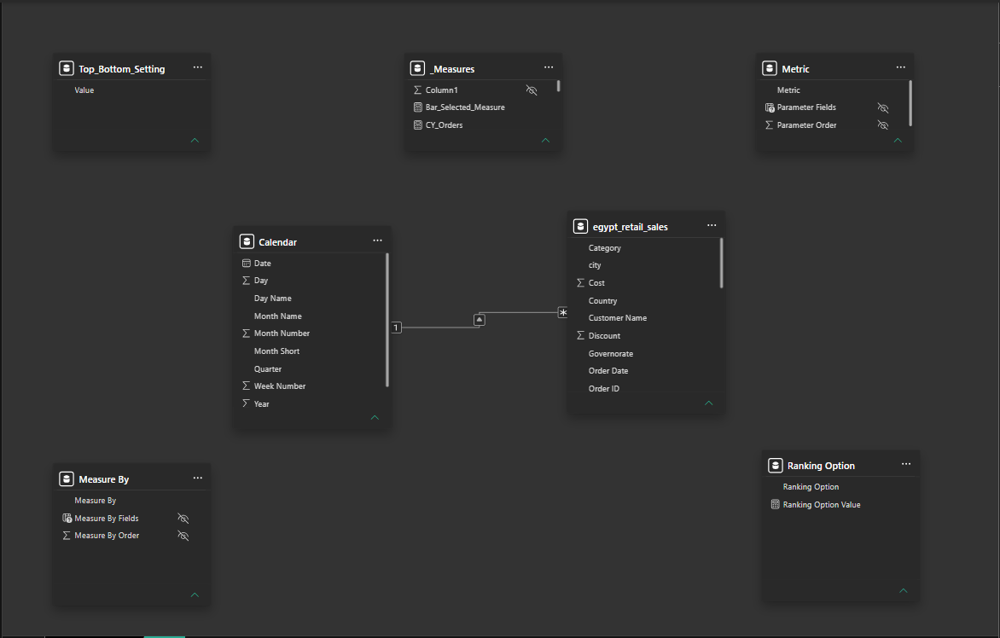

# Data Model Overview

The report uses a lightweight Power BI data model consisting of a single transactional fact table, a dedicated Calendar dimension, a centralized measure table, and several supporting parameter tables that enable dynamic report interactions.

Core Model

| Table              | Category       | Purpose                                 |
| ------------------ | -------------- | --------------------------------------- |
| egypt_retail_sales | Fact Table     | Stores all retail transactions          |
| Calendar           | Date Dimension | Supports Time Intelligence calculations |
| _Measures          | Measure Table  | Centralizes all DAX calculations        |


Supporting Tables

| Table              | Category        | Purpose                     |
| ------------------ | --------------- | --------------------------- |
| Measure By         | Field Parameter | Dynamic measure selection   |
| Metric             | Field Parameter | Dynamic dimension selection |
| Ranking_Option     | Parameter Table | Controls Top/Bottom N value |
| Top_Bottom_Setting | Parameter Table | Controls ranking direction  |


# Relationship Diagram




                 Calendar
              (Date Dimension)
                     1
                     │
                     │
                     ▼
          egypt_retail_sales
             (Fact Table)

────────────────────────────────────

Disconnected Tables

_Measures
Measure By
Metric
Ranking_Option
Top_Bottom_Setting

All parameter tables are intentionally disconnected from the data model. Their values are consumed directly by DAX measures to drive dynamic report behavior without affecting model relationships.

## Design Principles

- Single transaction fact table: A denormalized transaction table was intentionally used to keep the template simple and focused on Power BI report development rather than dimensional modeling.
- Dedicated Calendar table
- Centralized Measure table
- Disconnected parameter tables
- Dynamic report interactions

## Related Documentation

- [DAX_Documentation.md](Dax_Documentation.md) — Complete documentation for every DAX measure used throughout the report.
- [README.md](../README.md) — Project overview, features, and setup instructions.

# Calendar Table (Power Query M)

## Purpose

Creates a dedicated Calendar table that serves as the report's central date dimension for all Time Intelligence calculations.

Unlike Power BI's Auto Date/Time feature, this implementation automatically generates the calendar based on the minimum and maximum **Order Date** values found in the sales dataset, ensuring that the date range always matches the underlying data.

---

## Business Logic

The Calendar table is generated dynamically using **Power Query (M)** by:

1. Reading the minimum and maximum order dates from the sales table.
2. Generating every date within that range.
3. Creating a dedicated Date table.
4. Adding commonly used date attributes required for reporting and Time Intelligence.

This approach creates a reusable date dimension that supports consistent filtering, Year-over-Year analysis, and other DAX calculations throughout the report.

---

## M Script

```powerquery
let
    // Get minimum and maximum dates from the sales table
    Source = egypt_retail_sales,

    MinDate = Date.From(List.Min(Source[Order Date])),
    MaxDate = Date.From(List.Max(Source[Order Date])),

    // Generate list of dates
    DateList = List.Dates(
        MinDate,
        Duration.Days(MaxDate - MinDate) + 1,
        #duration(1,0,0,0)
    ),

    // Convert to table
    Calendar = Table.FromList(DateList, Splitter.SplitByNothing(), {"Date"}),

    // Ensure Date type
    #"Changed Type" = Table.TransformColumnTypes(Calendar,{{"Date", type date}}),

    // Add Date Attributes
    #"Year" = Table.AddColumn(#"Changed Type", "Year", each Date.Year([Date]), Int64.Type),
    #"Quarter" = Table.AddColumn(#"Year", "Quarter", each "Q" & Number.ToText(Date.QuarterOfYear([Date])), type text),
    #"Month Number" = Table.AddColumn(#"Quarter", "Month Number", each Date.Month([Date]), Int64.Type),
    #"Month Name" = Table.AddColumn(#"Month Number", "Month Name", each Date.ToText([Date], "MMMM"), type text),
    #"Month Short" = Table.AddColumn(#"Month Name", "Month Short", each Date.ToText([Date], "MMM"), type text),
    #"Year Month" = Table.AddColumn(#"Month Short", "Year Month", each Date.ToText([Date], "yyyy-MM"), type text),
    #"Day" = Table.AddColumn(#"Year Month", "Day", each Date.Day([Date]), Int64.Type),
    #"Day Name" = Table.AddColumn(#"Day", "Day Name", each Date.DayOfWeekName([Date]), type text),
    #"Week Number" = Table.AddColumn(#"Day Name", "Week Number", each Date.WeekOfYear([Date]), Int64.Type)

in
    #"Week Number"
```

---

## Generated Columns

| Column | Description |
|---------|-------------|
| Date | Calendar date |
| Year | Calendar year |
| Quarter | Calendar quarter (Q1–Q4) |
| Month Number | Month index (1–12) |
| Month Name | Full month name |
| Month Short | Abbreviated month name |
| Year Month | Combined Year-Month value (yyyy-MM) |
| Day | Day of month |
| Day Name | Weekday name |
| Week Number | Week number within the year |

---

## Advantages

- Automatically adjusts to the dataset's date range.
- Eliminates the need for Power BI Auto Date/Time.
- Provides a centralized and reusable Date dimension.
- Improves Time Intelligence consistency.
- Simplifies future maintenance when the dataset changes.

---

## Used By

- Current Year (CY) measures
- Previous Year (PY) measures
- Year-over-Year Growth calculations
- Trend Analysis
- Monthly Visualizations
- Date Slicers
- Time Intelligence DAX measures


## Summary

The report adopts a lightweight, maintainable Power BI data model centered around a single fact table and a dedicated Calendar dimension.

Rather than relying on complex relationships, report interactivity is driven by disconnected parameter tables, Field Parameters, and reusable DAX measures. This architecture keeps the model simple while enabling highly dynamic report behavior, making the template easy to understand, maintain, and extend.

