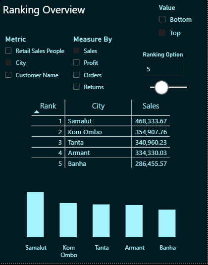
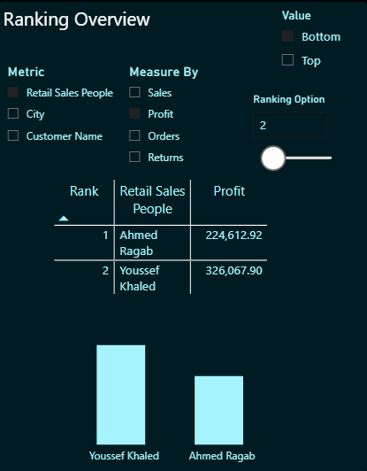
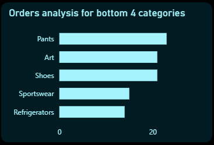
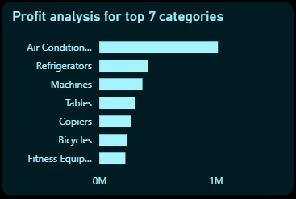

# DAX Documentation

## Overview

This document serves as the technical reference for all DAX measures implemented in the Power BI template.

The measures are organized into logical categories based on their purpose, making it easier to understand the report architecture, maintain calculations, and extend the template for different datasets.

The documentation covers:
- Purpose of each measure
- Business logic
- DAX formula
- Dependencies
- Where the measure is used within the report
- Implementation notes (when applicable)

> **Note:** All time intelligence calculations are based on the dedicated `Calendar` table rather than Power BI's Auto Date/Time feature.

The DAX measures documented in this file operate on the Power BI data model described in **[Data_Model.md](Data_Model.md)**. Understanding the model architecture, relationships, Calendar table, and parameter tables will provide the necessary context for the calculations documented below.

## Contents

1. Financial Metrics (FM-) 
2. Time Intelligence (TI-) 
3. Card Formatting   (CF-)
4. Field Parameters  (FD-)
5. Chart Logic       (CL-)
6. Dynamic Titles    (DT-)


| Category             | Description                                                                                                  		  	  |
|----------------------|--------------------------------------------------------------------------------------------------------------	         	  |
| Financial Metrics    | Core business calculations such as Sales, Profit, Orders, Revenue, and Returns.                             		  	  |
| Time Intelligence    | Current Year, Previous Year, Growth, and year-over-year calculations.                                        		  	  |
| Card Formatting      | Measures used to dynamically control KPI text, icons, colors, and formatting.                                		  	  |
| Field Parameters     | Field Parameters and supporting parameter tables used to drive dynamic measure selection, ranking, and user interaction. 	  |
| Chart Logic          | Advanced DAX measures responsible for dynamic measure selection, ranking, Top/Bottom filtering, and interactive visual behavior. |
| Dynamic Titles       | Measures that generate context-aware report and visual titles.                                                			  |


# Overall DAX Architecture
```text
                         DAX Architecture

                               User
                                 │
                                 ▼
                        Report Interactions
                                 │
        ┌────────────────────────┼────────────────────────┐
        ▼                        ▼                        ▼
 Time Intelligence     Field & Report Parameters     Financial Metrics
        │                        │                        │
        └────────────────────────┼────────────────────────┘
                                 ▼
                          Chart Logic
                                 │
                 ┌───────────────┼───────────────┐
                 ▼               ▼               ▼
          Card Formatting   Dynamic Titles   Interactive Visuals
```

## Naming Convention

All measures follow a consistent naming convention to improve readability and maintainability.

Examples:

- Total_* : Base business measures
- CY_* : Current Year calculations
- PY_* : Previous Year calculations
- *_Growth : Year-over-Year growth calculations
- Selected_* : Dynamic measures driven by field parameters


## Measure Categories

The measures are grouped based on their functional responsibility rather than their order of creation.

This organization improves navigation and makes future maintenance easier.


# 1- Financial Metrics (FM-)

Financial Metrics represent the core business calculations used throughout the report.

These measures provide the foundation for KPIs, rankings, dynamic visualizations, and time intelligence calculations.


## FM-01 Total_Sales

### Purpose
Calculates the total sales amount within the current filter context.

### Business Logic
Aggregates the Sales column while respecting all active report filters, slicers, and relationships.

### DAX Formula

```DAX
Total_Sales =
SUM('egypt_retail_sales'[Sales])
```

### Used In
- KPI Cards
- Dynamic Visualizations
- Ranking Analysis
- Time Intelligence measures
- Dynamic Visuals

### Notes
This is a foundational measure used throughout the report and serves as the base for several advanced calculations.

## FM-02 Total_Orders

### Purpose
Calculates the total number of unique orders within the current filter context.

### DAX Formula

```DAX
Total_Orders =
DISTINCTCOUNT('egypt_retail_sales'[Order ID])
```

### Used In
- KPI Cards
- Dynamic Visualizations
- Ranking Analysis
- Time Intelligence Measures
- Dynamic Visuals

### Notes
`DISTINCTCOUNT` is used instead of `COUNTROWS` to provide an accurate order count regardless of the number of transaction rows associated with each order.

## FM-03 Total_Profit

### Purpose
Calculates the total profit generated within the current filter context.

### Business Logic
Aggregates all values from the `Profit` column while respecting active report filters, slicers, and model relationships.

### DAX Formula

```DAX
Total_Profit =
SUM('egypt_retail_sales'[Profit])
```

### Used In
- KPI Cards
- Dynamic Visualizations
- Ranking Analysis
- Time Intelligence Measures
- Dynamic Visuals


## FM-04 Total_Revenue

### Purpose
Calculates the total revenue generated within the current filter context.

### Business Logic
Aggregates all values from the `Revenue` column while respecting active report filters, slicers, and model relationships.

### DAX Formula

```DAX
Total_Revenue =
SUM('egypt_retail_sales'[Revenue])
```

### Used In
- KPI Cards
- Dynamic Visualizations
- Ranking Analysis
- Time Intelligence Measures
- Dynamic Visuals

### Notes
Revenue is tracked separately from Sales to support business scenarios where gross revenue and net sales are analyzed independently.

## FM-05 - Total_Returns

### Purpose
Calculates the total number of returned orders within the current filter context.

### Business Logic
Counts all transactions where the `Returned` status is `"Yes"` while respecting the active report filters, slicers, and model relationships.

### DAX Formula

```DAX
Total_Returns =
CALCULATE(
    COUNTROWS('egypt_retail_sales'),
    'egypt_retail_sales'[Returned] = "Yes"
)
```

### Used In
- KPI Cards
- Dynamic Visualizations
- Ranking Analysis
- Time Intelligence Measures
- Dynamic Visuals

### Notes
`CALCULATE` modifies the filter context to include only records marked as returned (`Returned = "Yes"`). Using `COUNTROWS` provides the total number of returned transactions based on the current report context.


# 2. Time Intelligence (TI-)

Time Intelligence measures provide year-based business comparisons using the dedicated Calendar table.

The implementation follows a Current Year (CY) versus Previous Year (PY) approach, allowing users to compare annual business performance across Sales, Profit, Orders, Revenue, and Returns.

**Design Assumption:** These measures are intended for year-level analysis, where a single year is selected and compared against its previous calendar year.

### Implementation Pattern

All Current Year (CY) and Previous Year (PY) measures follow a consistent implementation pattern:

1. Retrieve the selected year from the `Calendar` table.
2. If no year is selected, automatically use the latest available year in the data model.
3. Remove any existing year filter using `REMOVEFILTERS`.
4. Reapply the target year (Current Year or Previous Year) inside `CALCULATE`.

By standardizing this pattern across all Time Intelligence measures, the report remains consistent, resilient to future data updates, and independent of the system date.

## TI-01 CY_Sales

### Purpose
Calculates the total sales for the selected calendar year. If no year is selected, the measure automatically defaults to the latest year available in the Calendar table.

### Business Logic
Determines the target year based on the user's selection. When no year filter is applied, the measure retrieves the latest available year from the Calendar table and uses it as the Current Year (CY). It then removes any existing year filter before applying the target year to ensure consistent and predictable results.

### DAX Formula

```DAX
CY_Sales =
VAR SelectedYear =
    SELECTEDVALUE(Calendar[Year])

VAR LatestYear =
    CALCULATE(
        MAX(Calendar[Year]),
        REMOVEFILTERS(Calendar)
    )

VAR FinalCYYear =
    COALESCE(SelectedYear, LatestYear)

RETURN
CALCULATE(
    SUM('egypt_retail_sales'[Sales]),
    REMOVEFILTERS(Calendar[Year]),
    Calendar[Year] = FinalCYYear
)
```

### Dependencies
- Calendar[Year]
- 'egypt_retail_sales'[Sales]

### Used In
- KPI Cards
- Year-over-Year Comparison
- Growth Rate Calculations
- Trend Visualizations

### Notes
This measure serves as the Current Year (CY) reference for all sales-related Time Intelligence calculations. By defaulting to the latest year available in the Calendar table, the report remains functional and automatically adapts as new data is added, without relying on the system date.

## TI-02 CY_Profit

### Purpose
Calculates the total profit for the Current Year (CY).

### Business Logic
Calculates the total profit for the target Current Year using the standardized Time Intelligence implementation shared across all CY/PY measures.

### DAX Formula

```DAX
CY_Profit =
VAR SelectedYear =
    SELECTEDVALUE(Calendar[Year])

VAR LatestYear =
    CALCULATE(
        MAX(Calendar[Year]),
        REMOVEFILTERS(Calendar)
    )

VAR FinalCYYear =
    COALESCE(SelectedYear, LatestYear)

RETURN
CALCULATE(
    SUM('egypt_retail_sales'[Profit]),
    REMOVEFILTERS(Calendar[Year]),
    Calendar[Year] = FinalCYYear
)
```

### Dependencies
- Calendar[Year]
- 'egypt_retail_sales'[Profit]

### Used In
- KPI Cards
- Year-over-Year Comparison
- Growth Rate Calculations

### Notes
Serves as the Current Year (CY) profit reference for all profit-related Time Intelligence calculations.


## TI-03 CY_Returns

### Purpose
Calculates the total number of returned transactions for the Current Year (CY).

### Business Logic
Filters the sales table to include only transactions marked as returned (`Returned = "Yes"`), then calculates the total number of returned transactions for the target Current Year using the standardized Time Intelligence implementation.

### DAX Formula

```DAX
CY_Returns =
VAR SelectedYear =
    SELECTEDVALUE(Calendar[Year])

VAR LatestYear =
    CALCULATE(
        MAX(Calendar[Year]),
        REMOVEFILTERS(Calendar)
    )

VAR FinalCYYear =
    COALESCE(SelectedYear, LatestYear)

RETURN
CALCULATE(
    COUNTROWS('egypt_retail_sales'),
    'egypt_retail_sales'[Returned] = "Yes",
    REMOVEFILTERS(Calendar[Year]),
    Calendar[Year] = FinalCYYear
)
```

### Dependencies
- Calendar[Year]
- 'egypt_retail_sales'[Returned]

### Used In
- KPI Cards
- Year-over-Year Comparison
- Growth Rate Calculations

### Notes
Only transactions marked as returned (`Returned = "Yes"`) are included in the calculation. The measure counts qualifying rows rather than non-blank values, providing a clear representation of returned transactions.


## TI-04 CY_Orders

### Purpose
Calculates the total number of unique orders for the Current Year (CY).

### Business Logic
Counts distinct Order IDs for the target Current Year using the standardized Time Intelligence implementation shared across all CY/PY measures.

### DAX Formula

```DAX
CY_Orders =
VAR SelectedYear =
    SELECTEDVALUE(Calendar[Year])

VAR LatestYear =
    CALCULATE(
        MAX(Calendar[Year]),
        REMOVEFILTERS(Calendar)
    )

VAR FinalCYYear =
    COALESCE(SelectedYear, LatestYear)

RETURN
CALCULATE(
    DISTINCTCOUNT('egypt_retail_sales'[Order ID]),
    REMOVEFILTERS(Calendar[Year]),
    Calendar[Year] = FinalCYYear
)
```

### Dependencies
- Calendar[Year]
- 'egypt_retail_sales'[Order ID]

### Used In
- KPI Cards
- Year-over-Year Comparison
- Growth Rate Calculations

### Notes
Uses `DISTINCTCOUNT` to ensure each order is counted only once for the target Current Year, regardless of the number of transaction records associated with the order.


## TI-05 PY_Sales

### Purpose
Calculates the total sales for the Previous Year (PY).

### Business Logic
Calculates the total sales for the year immediately preceding the target Current Year using the standardized Time Intelligence implementation shared across all CY/PY measures.

### DAX Formula

```DAX
PY_Sales =
VAR SelectedYear =
    SELECTEDVALUE(Calendar[Year])

VAR LatestYear =
    CALCULATE(
        MAX(Calendar[Year]),
        REMOVEFILTERS(Calendar)
    )

VAR FinalCYYear =
    COALESCE(SelectedYear, LatestYear)

VAR FinalPYYear =
    FinalCYYear - 1

RETURN
CALCULATE(
    SUM('egypt_retail_sales'[Sales]),
    REMOVEFILTERS(Calendar[Year]),
    Calendar[Year] = FinalPYYear
)
```

### Dependencies
- Calendar[Year]
- 'egypt_retail_sales'[Sales]

### Used In
- KPI Cards
- Year-over-Year Comparison
- Growth Rate Calculations

### Notes
Serves as the Previous Year (PY) sales reference for all sales-related Time Intelligence calculations.


## TI-06 PY_Profit

### Purpose
Calculates the total profit for the Previous Year (PY).

### Business Logic
Calculates the total profit for the year immediately preceding the target Current Year using the standardized Time Intelligence implementation shared across all CY/PY measures.

### DAX Formula

```DAX
PY_Profit =
VAR SelectedYear =
    SELECTEDVALUE(Calendar[Year])

VAR LatestYear =
    CALCULATE(
        MAX(Calendar[Year]),
        REMOVEFILTERS(Calendar)
    )

VAR FinalCYYear =
    COALESCE(SelectedYear, LatestYear)

VAR FinalPYYear =
    FinalCYYear - 1

RETURN
CALCULATE(
    SUM('egypt_retail_sales'[Profit]),
    REMOVEFILTERS(Calendar[Year]),
    Calendar[Year] = FinalPYYear
)
```

### Dependencies
- Calendar[Year]
- 'egypt_retail_sales'[Profit]

### Used In
- KPI Cards
- Year-over-Year Comparison
- Growth Rate Calculations

### Notes
Serves as the Previous Year (PY) profit reference for all profit-related Time Intelligence calculations.


## TI-07 PY_Returns

### Purpose
Calculates the total number of returned transactions for the Previous Year (PY).

### Business Logic
Filters the sales table to include only transactions marked as returned (`Returned = "Yes"`), then calculates the total number of returned transactions for the year immediately preceding the target Current Year using the standardized Time Intelligence implementation.

### DAX Formula

```DAX
PY_Returns =
VAR SelectedYear =
    SELECTEDVALUE(Calendar[Year])

VAR LatestYear =
    CALCULATE(
        MAX(Calendar[Year]),
        REMOVEFILTERS(Calendar)
    )

VAR FinalCYYear =
    COALESCE(SelectedYear, LatestYear)

VAR FinalPYYear =
    FinalCYYear - 1

RETURN
CALCULATE(
    COUNTROWS('egypt_retail_sales'),
    'egypt_retail_sales'[Returned] = "Yes",
    REMOVEFILTERS(Calendar[Year]),
    Calendar[Year] = FinalPYYear
)
```

### Dependencies
- Calendar[Year]
- 'egypt_retail_sales'[Returned]

### Used In
- KPI Cards
- Year-over-Year Comparison
- Growth Rate Calculations

### Notes
Only transactions marked as returned (`Returned = "Yes"`) are included in the calculation. The measure counts qualifying rows rather than non-blank values, providing a clear representation of returned transactions for the Previous Year (PY).


## TI-08 PY_Orders

### Purpose
Calculates the total number of unique orders for the Previous Year (PY).

### Business Logic
Counts distinct Order IDs for the year immediately preceding the target Current Year using the standardized Time Intelligence implementation shared across all CY/PY measures.

### DAX Formula

```DAX
PY_Orders =
VAR SelectedYear =
    SELECTEDVALUE(Calendar[Year])

VAR LatestYear =
    CALCULATE(
        MAX(Calendar[Year]),
        REMOVEFILTERS(Calendar)
    )

VAR FinalCYYear =
    COALESCE(SelectedYear, LatestYear)

VAR FinalPYYear =
    FinalCYYear - 1

RETURN
CALCULATE(
    DISTINCTCOUNT('egypt_retail_sales'[Order ID]),
    REMOVEFILTERS(Calendar[Year]),
    Calendar[Year] = FinalPYYear
)
```

### Dependencies
- Calendar[Year]
- 'egypt_retail_sales'[Order ID]

### Used In
- KPI Cards
- Year-over-Year Comparison
- Growth Rate Calculations

### Notes
Uses `DISTINCTCOUNT` to ensure each order is counted only once for the target Previous Year, regardless of the number of transaction records associated with the order.


## TI-09 Sales_Growth_%

### Purpose
Calculates the year-over-year (YoY) sales growth percentage by comparing Current Year (CY) sales with Previous Year (PY) sales.

### Business Logic
Calculates the net increase in sales by subtracting Previous Year sales from Current Year sales, then divides the result by Previous Year sales to determine the growth rate.

### DAX Formula

```DAX
Sales_Growth_% =
VAR CY = [CY_Sales]
VAR PY = [PY_Sales]

VAR NetIncrease = CY - PY

RETURN
DIVIDE(NetIncrease, PY, 0)
```

### Dependencies
- CY_Sales
- PY_Sales

### Used In
- KPI Cards
- Year-over-Year Comparison

### Notes
Uses the `DIVIDE` function instead of the division operator (`/`) to safely handle divide-by-zero scenarios by returning `0` when the Previous Year value is zero.


## TI-10 Profit_Growth_%

### Purpose
Calculates the year-over-year (YoY) profit growth percentage by comparing Current Year (CY) profit with Previous Year (PY) profit.

### Business Logic
Determines the profit increase between the current and previous year, then calculates the corresponding growth percentage.

### DAX Formula

```DAX
Profit_Growth_% =
VAR CY = [CY_Profit]
VAR PY = [PY_Profit]

VAR NetIncrease = CY - PY

RETURN
DIVIDE(NetIncrease, PY, 0)
```

### Dependencies
- CY_Profit
- PY_Profit

### Used In
- KPI Cards
- Year-over-Year Comparison

### Notes
Returns `0` when the Previous Year profit is zero to avoid divide-by-zero errors.

## TI-11 Orders_Growth_%

### Purpose
Calculates the year-over-year (YoY) order growth percentage by comparing Current Year (CY) orders with Previous Year (PY) orders.

### Business Logic
Computes the increase in total orders and expresses it as a percentage of the Previous Year order count.

### DAX Formula

```DAX
Orders_Growth_% =
VAR CY = [CY_Orders]
VAR PY = [PY_Orders]

VAR NetIncrease = CY - PY

RETURN
DIVIDE(NetIncrease, PY, 0)
```

### Dependencies
- CY_Orders
- PY_Orders

### Used In
- KPI Cards
- Year-over-Year Comparison

### Notes
Implements safe division using `DIVIDE`, ensuring consistent behavior when no orders exist in the Previous Year.


## TI-12 Returns_Growth_%

### Purpose
Calculates the year-over-year (YoY) growth percentage for returned transactions.

### Business Logic
Calculates the change in returned transactions between the Current Year and Previous Year and expresses it as a percentage of the Previous Year value.

### DAX Formula

```DAX
Returns_Growth_% =
VAR CY = [CY_Returns]
VAR PY = [PY_Returns]

VAR NetIncrease = CY - PY

RETURN
DIVIDE(NetIncrease, PY, 0)
```

### Dependencies
- CY_Returns
- PY_Returns

### Used In
- KPI Cards
- Year-over-Year Comparison

### Notes
Uses `DIVIDE` to safely perform the calculation and return `0` when the Previous Year contains no returned transactions.


### Summary

The Time Intelligence layer is built on top of the Financial Metrics and the dedicated Calendar table.

The implementation follows a three-level architecture:

1. Base Financial Measures
2. Current Year (CY) and Previous Year (PY) calculations
3. Year-over-Year Growth calculations

This layered architecture promotes measure reusability, simplifies maintenance, and ensures consistent business logic across all report visuals.


# 3. Card Formatting

Card Formatting measures are responsible for transforming calculated values into presentation-ready text for KPI cards.

Rather than performing additional business calculations, these measures focus on improving readability by applying:
- Currency formatting
- Number abbreviation (K, M, B)
- Text prefixes (e.g., CY, PY)
- Consistent display formatting across KPI visuals

This separation between calculation and presentation improves maintainability, promotes measure reusability, and keeps business logic independent from visual formatting.

## CF-01 CY_Sales_Text

### Purpose
Formats the Current Year (CY) sales value into a compact, presentation-ready text string for KPI cards.

### Business Logic
Retrieves the calculated Current Year sales value, applies dynamic number abbreviation based on its magnitude (K, M, or B), formats the value as Egyptian Pounds (EGP), and prefixes the result with `"CY"`.

### DAX Formula

```DAX
CY_Sales_Text =
VAR CY_Val = [CY_Sales]
VAR CY_Formatted =
    SWITCH(
        TRUE(),
        CY_Val >= 1000000000, FORMAT(CY_Val / 1000000000, "EGP #,0.0") & "B",
        CY_Val >= 1000000,    FORMAT(CY_Val / 1000000, "EGP #,0.0") & "M",
        CY_Val >= 1000,       FORMAT(CY_Val / 1000, "EGP #,0") & "K",
        TRUE(),               FORMAT(CY_Val, "EGP #,0")
    )

RETURN
"CY " & CY_Formatted
```

### Dependencies
- CY_Sales

### Used In
- KPI Cards

### Notes
This measure is designed exclusively for display purposes. It does not perform any business calculations and should not be used in analytical measures.

## CF-02 CY_Profit_Text

### Purpose
Formats the Current Year (CY) profit value into a compact, presentation-ready text string for KPI cards.

### Business Logic
Retrieves the calculated Current Year profit value, applies dynamic number abbreviation based on its magnitude (K, M, or B), formats the value as Egyptian Pounds (EGP), and prefixes the result with `"CY"`.

### DAX Formula

```DAX
CY_Profit_Text =
VAR CY_Val = [CY_Profit]
VAR CY_Formatted =
    SWITCH(
        TRUE(),
        CY_Val >= 1000000000, FORMAT(CY_Val / 1000000000, "EGP #,0.0") & "B",
        CY_Val >= 1000000,    FORMAT(CY_Val / 1000000, "EGP #,0.0") & "M",
        CY_Val >= 1000,       FORMAT(CY_Val / 1000, "EGP #,0") & "K",
        TRUE(),               FORMAT(CY_Val, "EGP #,0")
    )

RETURN
"CY " & CY_Formatted
```

### Dependencies
- CY_Profit

### Used In
- KPI Cards

### Notes
This measure is intended for presentation purposes only. It formats the calculated profit value into a human-readable string while preserving the underlying analytical measure for business calculations.

## CF-03 CY_Orders_Text

### Purpose
Formats the Current Year (CY) order count into a compact, presentation-ready text string for KPI cards.

### Business Logic
Retrieves the calculated Current Year order count, abbreviates large values using the **K** suffix, and prefixes the formatted value with `"CY"` to provide a consistent KPI display.

### DAX Formula

```DAX
CY_Orders_Text =
VAR CY_Val = [CY_Orders]
VAR CY_Formatted =
    SWITCH(
        TRUE(),
        CY_Val >= 1000, FORMAT(CY_Val / 1000, "#,0.0") & "K",
        TRUE(),         FORMAT(CY_Val, "#,0")
    )

RETURN
"CY " & CY_Formatted
```

### Dependencies
- CY_Orders

### Used In
- KPI Cards

### Notes
This measure is intended for presentation purposes only. Unlike currency-based measures, it formats numeric order counts without applying a currency symbol, while abbreviating values greater than or equal to one thousand using the **K** suffix.

## CF-04 CY_Returns_Text

### Purpose
Formats the Current Year (CY) returned transaction count into a presentation-ready text string for KPI cards.

### Business Logic
Retrieves the calculated Current Year returns value, formats it as a whole number with thousand separators, and prefixes the result with `"CY"` to maintain a consistent KPI display.

### DAX Formula

```DAX
CY_Returns_Text =
VAR CY_Val = [CY_Returns]
VAR CY_Formatted = FORMAT(CY_Val, "#,0")

RETURN
"CY " & CY_Formatted
```

### Dependencies
- CY_Returns

### Used In
- KPI Cards

### Notes
This measure is intended for presentation purposes only. Since return counts are typically displayed as whole numbers, no value abbreviation (such as **K**, **M**, or **B**) is applied. The measure ensures consistent formatting across KPI cards while keeping the underlying analytical measure independent of presentation logic.


## CF-05 PY_Sales_Text

### Purpose
Formats the Previous Year (PY) sales value into a compact, presentation-ready text string for KPI cards.

### Business Logic
Retrieves the calculated Previous Year sales value, applies dynamic number abbreviation based on its magnitude (K, M, or B), formats the value as Egyptian Pounds (EGP), and prefixes the result with `"PY"`.

### DAX Formula

```DAX
PY_Sales_Text =
VAR PY_Val = [PY_Sales]
VAR PY_Formatted =
    SWITCH(
        TRUE(),
        PY_Val >= 1000000000, FORMAT(PY_Val / 1000000000, "EGP #,0.0") & "B",
        PY_Val >= 1000000,    FORMAT(PY_Val / 1000000, "EGP #,0.0") & "M",
        PY_Val >= 1000,       FORMAT(PY_Val / 1000, "EGP #,0") & "K",
        TRUE(),               FORMAT(PY_Val, "EGP #,0")
    )

RETURN
"PY " & PY_Formatted
```

### Dependencies
- PY_Sales

### Used In
- KPI Cards

### Notes
This measure is intended for presentation purposes only. It formats the calculated Previous Year sales value into a compact, human-readable string while keeping the underlying analytical measure separate from presentation logic.

## CF-06 PY_Profit_Text

### Purpose
Formats the Previous Year (PY) profit value into a compact, presentation-ready text string for KPI cards.

### Business Logic
Retrieves the calculated Previous Year profit value, applies dynamic number abbreviation based on its magnitude (K, M, or B), formats the value as Egyptian Pounds (EGP), and prefixes the result with `"PY"`.

### DAX Formula

```DAX
PY_Profit_Text =
VAR PY_Val = [PY_Profit]
VAR PY_Formatted =
    SWITCH(
        TRUE(),
        PY_Val >= 1000000000, FORMAT(PY_Val / 1000000000, "EGP #,0.0") & "B",
        PY_Val >= 1000000,    FORMAT(PY_Val / 1000000, "EGP #,0.0") & "M",
        PY_Val >= 1000,       FORMAT(PY_Val / 1000, "EGP #,0") & "K",
        TRUE(),               FORMAT(PY_Val, "EGP #,0")
    )

RETURN
"PY " & PY_Formatted
```

### Dependencies
- PY_Profit

### Used In
- KPI Cards

### Notes
This measure is intended for presentation purposes only. It formats the calculated Previous Year profit value into a compact, human-readable string while keeping business calculations independent from visual formatting.


## CF-07 PY_Orders_Text

### Purpose
Formats the Previous Year (PY) order count into a compact, presentation-ready text string for KPI cards.

### Business Logic
Retrieves the calculated Previous Year order count, abbreviates large values using the **K** suffix, and prefixes the formatted value with `"PY"` to provide a consistent KPI display.

### DAX Formula

```DAX
PY_Orders_Text =
VAR PY_Val = [PY_Orders]
VAR PY_Formatted =
    SWITCH(
        TRUE(),
        PY_Val >= 1000, FORMAT(PY_Val / 1000, "#,0.0") & "K",
        TRUE(),         FORMAT(PY_Val, "#,0")
    )

RETURN
"PY " & PY_Formatted
```

### Dependencies
- PY_Orders

### Used In
- KPI Cards

### Notes
This measure is intended for presentation purposes only. Unlike currency-based measures, it formats numeric order counts without applying a currency symbol while abbreviating values greater than or equal to one thousand using the **K** suffix. The underlying `PY_Orders` measure remains the authoritative source for analytical calculations.

## CF-08 PY_Returns_Text

### Purpose
Formats the Previous Year (PY) returned transaction count into a presentation-ready text string for KPI cards.

### Business Logic
Retrieves the calculated Previous Year returns value, formats it as a whole number with thousand separators, and prefixes the result with `"PY"` to maintain a consistent KPI display.

### DAX Formula

```DAX
PY_Returns_Text =
VAR PY_Val = [PY_Returns]
VAR PY_Formatted = FORMAT(PY_Val, "#,0")

RETURN
"PY " & PY_Formatted
```

### Dependencies
- PY_Returns

### Used In
- KPI Cards

### Notes
This measure is intended for presentation purposes only. Since return counts are displayed as whole numbers, no value abbreviation (such as **K**, **M**, or **B**) is applied. The measure provides a consistent display format while keeping the underlying analytical measure separate from presentation logic.


## CF-09 Growth_With_Icon

### Purpose
Displays the Sales Year-over-Year (YoY) growth percentage with a visual indicator, using an upward arrow for positive growth and a downward arrow for negative growth.

### Business Logic
Retrieves the calculated sales growth percentage and evaluates whether the value is positive or negative. The measure prefixes the formatted percentage with an appropriate Unicode arrow to provide an immediate visual indication of performance.

### DAX Formula

```DAX
Growth_With_Icon =
VAR Growth = [Sales_Growth_%]

RETURN
IF(
    Growth >= 0,
    "▲ " & FORMAT(Growth, "+0.0%"),
    "▼ " & FORMAT(Growth, "0.0%")
)
```

Here is how the dynamic KPI cards automatically respond to performance changes, adjusting colors, indicators, and trends based on **Current Year (CY)** vs. **Previous Year (PY)** data:

| Negative Trend (Drop) | Positive Trend (Growth) |
| :---: | :---: |
|  |  |

### Dependencies
- Sales_Growth_%

### Used In
- KPI Cards

### Notes
This measure is intended for presentation purposes only. It combines a formatted percentage with a Unicode performance indicator (`▲` or `▼`) to improve readability and enable users to identify positive or negative year-over-year performance at a glance.


## CF-10 Profit_Growth_With_Icon

### Purpose
Displays the Profit Year-over-Year (YoY) growth percentage with a visual indicator, using an upward arrow for positive growth and a downward arrow for negative growth.

### Business Logic
Retrieves the calculated profit growth percentage and evaluates whether the value is positive or negative. The measure prefixes the formatted percentage with an appropriate Unicode arrow to provide an immediate visual indication of performance.

### DAX Formula

```DAX
Profit_Growth_With_Icon =
VAR Growth = [Profit_Growth_%]

RETURN
IF(
    Growth >= 0,
    "▲ " & FORMAT(Growth, "+0.0%"),
    "▼ " & FORMAT(Growth, "0.0%")
)
```

### Dependencies
- Profit_Growth_%

### Used In
- KPI Cards

### Notes
This measure is intended for presentation purposes only. It combines a formatted percentage with a Unicode performance indicator (`▲` or `▼`) to provide an intuitive visual representation of year-over-year profit performance. Positive values display an upward arrow, while negative values display a downward arrow.

## CF-11 Orders_Growth_With_Icon

### Purpose
Displays the Orders Year-over-Year (YoY) growth percentage with a visual indicator, using an upward arrow for positive growth and a downward arrow for negative growth.

### Business Logic
Retrieves the calculated order growth percentage and evaluates whether the value is positive or negative. The measure prefixes the formatted percentage with an appropriate Unicode arrow to provide an immediate visual indication of performance.

### DAX Formula

```DAX
Orders_Growth_With_Icon =
VAR Growth = [Orders_Growth_%]

RETURN
IF(
    Growth >= 0,
    "▲ " & FORMAT(Growth, "+0.0%"),
    "▼ " & FORMAT(Growth, "0.0%")
)
```

### Dependencies
- Orders_Growth_%

### Used In
- KPI Cards

### Notes
This measure is intended for presentation purposes only. It combines a formatted percentage with a Unicode performance indicator (`▲` or `▼`) to provide an intuitive visual representation of year-over-year order performance. Positive values display an upward arrow, while negative values display a downward arrow.

## CF-12 Returns_Growth_With_Icon

### Purpose
Displays the Returns Year-over-Year (YoY) growth percentage with a visual indicator, using an upward arrow for positive growth and a downward arrow for negative growth.

### Business Logic
Retrieves the calculated returns growth percentage and evaluates whether the value is positive or negative. The measure prefixes the formatted percentage with an appropriate Unicode arrow to provide an immediate visual indication of performance.

### DAX Formula

```DAX
Returns_Growth_With_Icon =
VAR Growth = [Returns_Growth_%]

RETURN
IF(
    Growth >= 0,
    "▲ " & FORMAT(Growth, "+0.0%"),
    "▼ " & FORMAT(Growth, "0.0%")
)
```

### Dependencies
- Returns_Growth_%

### Used In
- KPI Cards

### Notes
This measure is intended for presentation purposes only. It combines a formatted percentage with a Unicode performance indicator (`▲` or `▼`) to provide an intuitive visual representation of year-over-year returns performance. Positive values display an upward arrow, while negative values display a downward arrow.

### Summary

The Card Formatting layer is responsible for transforming analytical measures into presentation-ready values for KPI visuals.

Rather than introducing new business calculations, these measures enhance readability by:
- Formatting currencies and numeric values.
- Applying value abbreviations (K, M, and B).
- Adding contextual prefixes such as **CY** and **PY**.
- Displaying visual performance indicators using directional icons.

By separating presentation logic from business logic, the report remains easier to maintain, extend, and reuse across different datasets and report layouts.

### Key Design Principles

- Business calculations remain independent from visual formatting.
- Formatting measures are intended exclusively for report presentation.
- Consistent formatting rules are applied across all KPI cards.
- Reusable measures reduce duplication and simplify future maintenance.


# 4. Field Parameters

Field Parameters provide the foundation for the report's interactive behavior by allowing users to dynamically control both **what** is analyzed and **how** it is presented.

Instead of creating separate visuals for each business metric or analysis dimension, the report uses Field Parameters to drive a single reusable visualization. This approach significantly reduces report complexity while providing a flexible and scalable user experience.

Within this template, Field Parameters are used to dynamically:

- Switch between business measures (Sales, Profit, Orders, and Returns).
- Change the analysis dimension (Sales Person, City, or Customer).
- Control the number of displayed results (Top/Bottom N).
- Define the ranking direction (Top or Bottom).
- Drive advanced DAX measures responsible for dynamic ranking, filtering, and interactive visual behavior.

This architecture separates report configuration from business calculations, allowing the same DAX logic to adapt automatically based on user selections without requiring duplicate visuals or additional report pages.


## Example Scenarios:

### Scenario 1: Top 5 Cities by Sales



* **Current Selection Example (Scenario 1):** 
  * **Metric:** `City`
  * **Measure By:** `Sales`
  * **Ranking Option (Slicer):** `5`
  * **Value Toggle:** `Top`

### Scenario 2: Bottom 2 Salespeople by Profit



*   **Current Selection Example (Scenario 2):**
    *   **Metric:** `Retail Sales People` (Axis changed)
    *   **Measure By:** `Profit` (Measure changed)
    *   **Ranking Option (Slicer):** `2` (Number changed)
    *   **Value Toggle:** `Bottom` (Order flipped)


These examples demonstrate how a single visual can serve multiple analytical scenarios without duplicating charts or creating additional report pages.

By combining Field Parameters with reusable DAX measures, users can dynamically switch business measures, analysis dimensions, ranking direction, and the number of displayed results while the underlying visual automatically adapts to the selected configuration.


### Design Philosophy

The report follows a parameter-driven architecture, where user selections are treated as inputs to the DAX engine rather than fixed report configurations.

By centralizing user choices into reusable Field Parameters, the template achieves:

- Greater report flexibility.
- Reduced visual duplication.
- Simplified maintenance.
- Improved scalability for future enhancements.
- Consistent behavior across all interactive visuals.

```text
                         User Selections
                          │
      ┌──────────────┬────┴──────────────┐
      ▼              ▼                   ▼
 Measure By       Metric        Ranking Controls
                                     │
                         ┌───────────┴───────────┐
                         ▼                       ▼
                    Top / Bottom            Top N Value
                         │
                         └───────────┬───────────┘
                                     ▼
                           Dynamic DAX Engine
                                     │
                                     ▼
                         Interactive Visuals
```


## FP-01 Measure By

### Purpose

Provides a dynamic measure selector that enables report users to switch between the primary business metrics without modifying the report layout or creating duplicate visuals.

### Business Logic

This Field Parameter maps user selections to predefined DAX measures using the `NAMEOF()` function. The selected measure is then consumed by downstream calculations such as `Selected Measure`, dynamic ranking, and interactive visual logic.

By centralizing measure selection into a single parameter, the report can reuse the same visuals for multiple business metrics while maintaining consistent interactions and filtering behavior.

### Definition

```DAX
Measure By = {
    ("Sales", NAMEOF('_Measures'[Total_Sales]), 0),
    ("Profit", NAMEOF('_Measures'[Total_Profit]), 1),
    ("Orders", NAMEOF('_Measures'[Total_Orders]), 2),
    ("Returns", NAMEOF('_Measures'[Total_Returns]), 3)
}
```

### Available Options

| Display Name | Referenced Measure |
|--------------|--------------------|
| Sales | Total_Sales |
| Profit | Total_Profit |
| Orders | Total_Orders |
| Returns | Total_Returns |

### Dependencies

#### Consumed By

- Selected Measure
- Rank
- Dynamic Titles
- Interactive Visuals

#### References

- Total_Sales
- Total_Profit
- Total_Orders
- Total_Returns

### Used In

- Measure Selector Slicer
- Dynamic Visualization 
- Ranking Visuals
- KPI Analysis

### Notes

This is a Power BI **Field Parameter**, not a traditional DAX measure. The `NAMEOF()` function creates a reference to existing measures, allowing visuals to switch between business metrics dynamically without changing their structure.

Using a Field Parameter instead of separate visuals reduces report complexity, improves maintainability, and provides a more scalable architecture for interactive reporting.


## FP-02 Metric

### Purpose

Provides a dynamic analysis selector that allows users to change the categorical field used in report visuals without creating separate charts for each business dimension.

### Business Logic

This Field Parameter maps user selections to predefined categorical columns using the `NAMEOF()` function. The selected field becomes the active analysis category for supported visuals, enabling users to switch seamlessly between different business perspectives while preserving the same report layout.

Within this template, the selected metric determines how business measures are grouped, ranked, and visualized.

### Definition

```DAX
Metric = {
    ("Retail Sales People", NAMEOF('egypt_retail_sales'[sales_person]), 0),
    ("City", NAMEOF('egypt_retail_sales'[city]), 1),
    ("Customer Name", NAMEOF('egypt_retail_sales'[Customer Name]), 2)
}
```

### Available Options

| Display Name | Referenced Column |
|--------------|-------------------|
| Retail Sales People | sales_person |
| City | city |
| Customer Name | Customer Name |

### Dependencies

#### Consumed By

- Rank
- Dynamic Bar Chart
- Ranking Visuals
- Dynamic Titles

#### References

- egypt_retail_sales[sales_person]
- egypt_retail_sales[city]
- egypt_retail_sales[Customer Name]

### Used In

- Metric Selector Slicer
- Dynamic Bar Chart
- Ranking Visuals
- Interactive Analysis

### Notes

This is a Power BI **Field Parameter**, not a traditional DAX measure. The `NAMEOF()` function creates references to existing model columns, allowing visuals to dynamically change the analysis category while preserving the same visual configuration.

> **Note:** In this template, the term **Metric** refers to the analysis category (Sales Person, City, or Customer) rather than a numerical business measure. The numerical measures (Sales, Profit, Orders, and Returns) are controlled separately by the **Measure By** Field Parameter.

## FP-03 Ranking Option

### Purpose

Provides a dynamic numeric parameter that allows users to control how many ranked items are displayed in interactive visuals.

### Business Logic

The parameter generates a sequence of integers from **1** to **15**, enabling users to choose the desired number of Top or Bottom results through a slicer.

The selected value is later consumed by ranking measures to determine the maximum number of items displayed.

### Definition

```DAX
Ranking Option =
GENERATESERIES(1, 15, 1)
```

### Generated Values

- 1
- 2
- 3
- ...
- 15

### Dependencies

#### Consumed By

- Ranking Option Value
- Rank
- Interactive Ranking Visuals

### Used In

- Ranking Selector Slicer

### Notes

Although it behaves similarly to a parameter, this object is implemented as a calculated table using `GENERATESERIES()`. It serves as the source of user selections for the report's dynamic ranking engine.


## FP-04 Ranking Option Value

### Purpose

Retrieves the ranking limit selected by the user from the **Ranking Option** parameter.

### Business Logic

Returns the selected ranking value from the slicer. If no value is selected, the measure defaults to **5**, ensuring that ranking visuals always display a meaningful number of results.

### DAX Formula

```DAX
Ranking Option Value =
SELECTEDVALUE('Ranking Option'[Ranking Option], 5)
```

### Dependencies

#### References

- Ranking Option

#### Consumed By

- Rank

### Used In

- Dynamic Ranking Logic

### Notes

Using `SELECTEDVALUE()` with a default value ensures that ranking measures continue to operate correctly even when the slicer is cleared or no explicit selection is made.


## RP-01 Top_Bottom_Setting

### Purpose

Provides a user-controlled parameter that determines whether ranking visuals display the **Top** or **Bottom** performing items.

### Business Logic

This disconnected table supplies the ranking direction selected by the user through a slicer. The selected value is retrieved using `SELECTEDVALUE()` and consumed by ranking measures to dynamically switch between ascending and descending ranking.

### Table Definition

| Value |
|--------|
| Top |
| Bottom |

### Dependencies

#### Consumed By

- Rank
- Dynamic Titles
- Interactive Ranking Visuals

### Used In

- Ranking Direction Slicer

### Notes

This is a disconnected parameter table with no relationships to the data model. Its sole purpose is to capture user input and control the ranking direction through DAX measures.

The selected value is typically retrieved using:

```DAX
SELECTEDVALUE('Top_Bottom_Setting'[Value], "Top")
```

The default value is **"Top"**, ensuring consistent report behavior when no explicit selection is made.


### Summary

The report's interactive behavior is driven by a combination of Field Parameters and supporting parameter tables, allowing users to customize the analysis without modifying the report structure.

These parameters provide the input layer for the report by enabling users to:

- Select the business measure to analyze.
- Change the analysis metric.
- Define the number of ranked results.
- Control the ranking direction.

Rather than embedding these choices directly into individual visuals, the report centralizes user selections into reusable parameters that are consumed by advanced DAX measures throughout the model.

This parameter-driven architecture improves report flexibility, reduces visual duplication, and simplifies future maintenance and extensibility.

> **Next Section:** The following chapter explains how these parameters are consumed by advanced DAX measures to create dynamic rankings, interactive filtering, and reusable chart logic.

```txt
                 User Selections
                        │
        ┌───────────────┼───────────────┐
        ▼               ▼               ▼
   Measure By       Metric      Ranking Options
        │               │               │
        └───────────────┼───────────────┘
                        ▼
               Selected Measure
                        │
                        ▼
                  Ranking Engine
                  (Rank Measure)
                        │
                        ▼
               Interactive Visuals

```

# 5. Chart Logic (Advanced DAX)

Chart Logic represents the core decision-making layer of the report. Building upon the Field Parameters and report parameters introduced in the previous section, these measures transform user selections into dynamic visual behavior through advanced DAX calculations.

Rather than relying on separate visuals for each analysis scenario, the report uses a reusable logic engine capable of adapting automatically based on the user's selections.

These measures enable report consumers to dynamically:

- Switch between business measures.
- Change the active analysis metric.
- Display Top or Bottom N results.
- Calculate rankings using the selected business measure.
- Respond to slicers while preserving the appropriate filter context.
- Drive multiple visuals from a single reusable set of DAX measures.

This layer demonstrates advanced DAX techniques including context detection, dynamic measure selection, ranking, and filter context manipulation to build a scalable and highly interactive Power BI reporting solution.


## CL-01 Selected Measure

### Purpose

Returns the business measure currently selected by the user through the **Measure By** Field Parameter.

This measure enables a single visual to dynamically display different business metrics without requiring duplicate visuals or multiple DAX calculations.

### Business Logic

The measure reads the selected value from the **Measure By** Field Parameter and maps it to the corresponding business measure using the `SWITCH()` function.

Depending on the user's selection, it returns one of the following measures:

- Total Sales
- Total Profit
- Total Orders
- Total Returns

This dynamic approach allows all dependent visuals and calculations to respond automatically to the selected business metric.

### DAX Formula

```DAX
Selected Measure =
SWITCH(
    SELECTEDVALUE('Measure By'[Measure By Order]),
    0, [Total_Sales],
    1, [Total_Profit],
    2, [Total_Orders],
    3, [Total_Returns]
)
```

### Dependencies

#### References

- Measure By
- Total_Sales
- Total_Profit
- Total_Orders
- Total_Returns

#### Consumed By

- Rank
- Dynamic Bar Chart
- Dynamic Titles
- Interactive Visuals

### Used In

- Dynamic Bar Chart
- Ranking Visuals
- KPI Analysis
- Interactive DAX Measures

### Technical Notes

The measure uses the numeric order generated by the **Measure By** Field Parameter rather than comparing text values. This approach improves readability, simplifies maintenance, and avoids unnecessary string comparisons.

### Notes

This measure acts as the central business metric selector for the report. Many advanced DAX calculations reference this measure instead of individual business measures, making the report highly reusable and easier to extend.


## CL-02 Selected_Measure_Name

### Purpose

Returns the display name of the business measure currently selected in the **Measure By** Field Parameter.

### Business Logic

The measure retrieves the active measure name from the Field Parameter table and returns it as text. This value is primarily used for dynamic report titles and descriptive labels.

### DAX Formula

```DAX
Selected_Measure_Name =
MAXX (
    SUMMARIZE (
        'Measure By',
        'Measure By'[Measure By],
        'Measure By'[Measure By Fields]
    ),
    'Measure By'[Measure By]
)
```

### Dependencies

#### References

- Measure By

#### Consumed By

- Dynamic Titles
- Chart Titles
- Report Headers

### Used In

- Dynamic Visual Titles
- Report Labels

### Technical Notes

SUMMARIZE() constructs a summarized table containing the currently active Field Parameter context, while MAXX() returns the display label from the resulting table.

Because the active filter context contains only one selected measure, the returned value corresponds to the user's current selection.

### Notes

This measure retrieves the display name of the currently selected Field Parameter. A combination of SUMMARIZE() and MAXX() is used to reliably resolve the active parameter label within the current filter context, providing consistent results for dynamic titles and report labels.


## CL-03 Rank

### Purpose

Calculates a dynamic ranking for the selected analysis metric based on the currently selected business measure, ranking direction, and user-defined ranking limit.

This measure serves as the core ranking engine of the report, enabling reusable Top/Bottom N analysis across multiple business dimensions without requiring separate DAX measures or duplicate visuals.

### Business Logic

The measure retrieves the user-selected ranking limit and ranking direction before determining which analysis field is currently active.

Using `ISINSCOPE()`, it detects whether the visual is grouped by **Sales Person**, **City**, or **Customer Name**. It then applies `RANKX()` to the active category using the currently selected business measure.

The ranking direction is dynamically controlled through the **Top_Bottom_Setting** parameter:

- **Top** → Descending ranking (`DESC`)
- **Bottom** → Ascending ranking (`ASC`)

Finally, the measure compares the calculated rank against the selected ranking limit. Any item whose rank exceeds the selected limit returns `BLANK()`, allowing visuals to display only the requested Top or Bottom N results.

### DAX Formula

```DAX
Rank =
VAR SelectedLimit = [Ranking Option Value]

VAR SelectedSortOrder =
    SELECTEDVALUE('Top_Bottom_Setting'[Value], "Top")

VAR CalculatedRank =
    SWITCH(
        TRUE(),

        ISINSCOPE('egypt_retail_sales'[sales_person]) &&
        SelectedSortOrder = "Top",
            RANKX(
                ALLSELECTED('egypt_retail_sales'[sales_person]),
                [Selected Measure],
                ,
                DESC,
                DENSE
            ),

        ISINSCOPE('egypt_retail_sales'[sales_person]) &&
        SelectedSortOrder = "Bottom",
            RANKX(
                ALLSELECTED('egypt_retail_sales'[sales_person]),
                [Selected Measure],
                ,
                ASC,
                DENSE
            ),

        ISINSCOPE('egypt_retail_sales'[city]) &&
        SelectedSortOrder = "Top",
            RANKX(
                ALLSELECTED('egypt_retail_sales'[city]),
                [Selected Measure],
                ,
                DESC,
                DENSE
            ),

        ISINSCOPE('egypt_retail_sales'[city]) &&
        SelectedSortOrder = "Bottom",
            RANKX(
                ALLSELECTED('egypt_retail_sales'[city]),
                [Selected Measure],
                ,
                ASC,
                DENSE
            ),

        ISINSCOPE('egypt_retail_sales'[Customer Name]) &&
        SelectedSortOrder = "Top",
            RANKX(
                ALLSELECTED('egypt_retail_sales'[Customer Name]),
                [Selected Measure],
                ,
                DESC,
                DENSE
            ),

        ISINSCOPE('egypt_retail_sales'[Customer Name]) &&
        SelectedSortOrder = "Bottom",
            RANKX(
                ALLSELECTED('egypt_retail_sales'[Customer Name]),
                [Selected Measure],
                ,
                ASC,
                DENSE
            )
    )

RETURN
IF(
    CalculatedRank <= SelectedLimit,
    CalculatedRank,
    BLANK()
)
```

### Dependencies

#### References

- Selected Measure
- Ranking Option Value
- Top_Bottom_Setting

#### Uses

- RANKX()
- ISINSCOPE()
- ALLSELECTED()
- SWITCH()
- SELECTEDVALUE()

### Used In

- Dynamic Bar Chart
- Ranking Table
- Top / Bottom N Analysis
- Interactive Visuals

### Technical Notes

- `ISINSCOPE()` identifies which analysis metric is currently active, allowing a single measure to support multiple categorical fields.
- `ALLSELECTED()` preserves report filters and slicers while removing only the current row context, ensuring rankings are calculated within the user's selection.
- `RANKX()` performs the ranking using the dynamically selected business measure.
- `DENSE` ranking ensures consecutive rank values without gaps when ties occur.
- Returning `BLANK()` for ranks outside the selected limit automatically filters excess categories from report visuals.

### Notes

This measure is the core of the report's interactive ranking engine. By combining Field Parameters, disconnected parameter tables, and advanced DAX functions, a single reusable measure supports dynamic Top/Bottom analysis across multiple business dimensions and business measures without requiring duplicate visuals or separate ranking calculations.


## CL-04 Bar_Selected_Measure

### Purpose

Returns the selected business measure only for the Top or Bottom ranked **Sub-Categories**, enabling the Bar Chart to display a dynamic Top/Bottom N analysis based on user selections.

### Business Logic

The measure calculates the rank of each **Sub-Category** using the currently selected business measure and the ranking direction specified by the user.

If the calculated rank falls within the selected ranking limit, the measure returns the corresponding business value. Otherwise, it returns `BLANK()`, automatically excluding the category from the visual.

This approach allows the Bar Chart to respond dynamically to:

- Selected business measure.
- Ranking direction (Top or Bottom).
- User-defined ranking limit.

### DAX Formula

```DAX
Bar_Selected_Measure =
VAR SelectedLimit = [Ranking Option Value]

VAR SelectedSortOrder =
    SELECTEDVALUE('Top_Bottom_Setting'[Value], "Top")

VAR CalculatedRank =
    SWITCH(
        TRUE(),

        ISINSCOPE('egypt_retail_sales'[Sub-Category]) &&
        UPPER(SelectedSortOrder) = "TOP",

            RANKX(
                ALLSELECTED('egypt_retail_sales'[Sub-Category]),
                [Selected Measure],
                ,
                DESC,
                DENSE
            ),

        ISINSCOPE('egypt_retail_sales'[Sub-Category]) &&
        UPPER(SelectedSortOrder) = "BOTTOM",

            RANKX(
                ALLSELECTED('egypt_retail_sales'[Sub-Category]),
                [Selected Measure],
                ,
                ASC,
                DENSE
            )
    )

RETURN
IF(
    CalculatedRank <= SelectedLimit,
    [Selected Measure],
    BLANK()
)
```

### Dependencies

#### References

- Selected Measure
- Ranking Option Value
- Top_Bottom_Setting

#### Uses

- RANKX()
- ISINSCOPE()
- ALLSELECTED()
- SWITCH()
- SELECTEDVALUE()

### Used In

- Dynamic Bar Chart
- Top / Bottom Sub-Category Analysis

### Technical Notes

The measure performs the ranking internally rather than referencing the generic `Rank` measure because it is specifically designed for **Sub-Category** analysis.

Returning the business measure instead of the calculated rank allows the visual to display the actual metric values while automatically filtering out categories outside the selected ranking limit.

The use of `ALLSELECTED()` ensures that rankings respect the current report filters while evaluating all visible sub-categories.

### Notes

This measure is optimized for the report's dynamic Bar Chart. It combines ranking logic with measure selection to produce a reusable Top/Bottom N visualization that adapts automatically to user interactions without requiring multiple visuals or separate DAX measures.

### Summary

The Chart Logic layer transforms user selections into dynamic report behavior by combining Field Parameters, supporting parameter tables, and advanced DAX calculations.

Rather than creating separate visuals for each analysis scenario, the report relies on a small set of reusable measures that automatically adapt to the current filter context and user selections.

This architecture enables users to:

- Switch between multiple business measures using a single visual.
- Analyze different business metrics without duplicating report pages.
- Perform dynamic Top/Bottom N analysis.
- Apply context-aware ranking across multiple dimensions.
- Synchronize interactive behavior across visuals using shared DAX logic.

By separating user inputs from calculation logic, the report achieves a scalable, maintainable, and highly reusable design that can be extended with additional measures or dimensions with minimal changes.

> **Next Section:** The following chapter documents the Dynamic Title measures used throughout the report to automatically update visual titles based on user selections and report context.

```txt
             User Interaction
                    │
                    ▼
      Field & Report Parameters
                    │
        ┌───────────┼───────────┐
        ▼           ▼           ▼
 Selected Measure  Ranking   Filter Context
        │           │           │
        └───────────┼───────────┘
                    ▼
           Chart Logic Engine
                    │
        ┌───────────┼───────────┐
        ▼           ▼           ▼
     Rankings    Visual Data   Titles
                    │
                    ▼
          Interactive Visuals
```


# 6. Dynamic Titles

Dynamic Title measures automatically generate context-aware titles based on the user's current selections and report filters.

Instead of using static text, these measures dynamically reflect the selected business measure, ranking options, and analysis context, ensuring that each visual accurately describes the data being displayed.

This approach improves report readability, enhances the user experience, and provides meaningful context for exported reports, dashboards, and presentations.


## DT-01 Dynamic_Bar_Chart_Title

### Purpose

Generates a dynamic title for the Bar Chart based on the user's selected business measure, ranking direction, and ranking limit.

### Business Logic

The measure combines three user selections into a single descriptive title:

- The selected business measure (Sales, Profit, Orders, or Returns).
- The selected ranking direction (Top or Bottom).
- The selected ranking limit (Top/Bottom N).

As users change these selections through the report controls, the chart title updates automatically to reflect the current analysis.

### Example Scenarios

| Scenario A: Bottom 4 Categories by Orders | Scenario B: Top 7 Categories by Profit |
| :---: | :---: |
|  |  |
| **Measure By:** `Orders`<br>**Count:** `4`<br>**Toggle:** `Bottom`<br>**Dynamic Title:** *"Orders analysis for bottom 4 categories"* | **Measure By:** `Profit`<br>**Count:** `7`<br>**Toggle:** `Top`<br>**Dynamic Title:** *"Profit analysis for top 7 categories"* |

---

### DAX Formula

```DAX
Dynamic_Bar_Chart_Title =
VAR SelectedLimit = [Ranking Option Value]

VAR SelectedSortOrder =
    SELECTEDVALUE('Top_Bottom_Setting'[Value], "Top")

VAR SelectedMetricName =
    [Selected_Measure_Name]

RETURN
    SelectedMetricName &
    " analysis for " &
    LOWER(SelectedSortOrder) &
    " " &
    SelectedLimit &
    " categories"
```

### Dependencies

#### References

- Selected_Measure_Name
- Ranking Option Value
- Top_Bottom_Setting

#### Uses

- SELECTEDVALUE()
- LOWER()

### Used In

- Dynamic Bar Chart Title

### Technical Notes

The title is generated dynamically by concatenating the selected measure name, ranking direction, and ranking limit into a single descriptive string.

The `LOWER()` function is applied to the ranking direction to maintain consistent sentence formatting (for example, **"top"** instead of **"Top"**).

### Example Outputs

| User Selection | Generated Title |
|----------------|-----------------|
| Sales + Top 5 | Sales analysis for top 5 categories |
| Profit + Bottom 10 | Profit analysis for bottom 10 categories |
| Orders + Top 3 | Orders analysis for top 3 categories |
| Returns + Bottom 15 | Returns analysis for bottom 15 categories |

### Notes

Dynamic titles improve report usability by clearly communicating the active analysis context. This eliminates ambiguity and ensures that exported reports, screenshots, and presentations accurately describe the data being displayed.


## DT-02 Dynamic_Donut_Title

### Purpose

Generates a dynamic title for the Donut Chart based on the currently selected business measure.

### Business Logic

The measure retrieves the active business measure selected through the **Measure By** Field Parameter and inserts its name into a predefined question.

This ensures that the Donut Chart title always reflects the current analysis and remains synchronized with user selections.

### DAX Formula

```DAX
Dynamic_Donut_Title =
VAR SelectedMetric =
    [Selected_Measure_Name]

RETURN
    "WHICH SEGMENT CONTRIBUTED MOST TOWARDS TOTAL " &
    UPPER(SelectedMetric) &
    "?"
```

### Dependencies

#### References

- Selected_Measure_Name

#### Uses

- UPPER()

### Used In

- Dynamic Donut Chart Title

### Technical Notes

The `UPPER()` function converts the selected measure name to uppercase, creating a consistent visual style and emphasizing the business metric within the title.

### Example Outputs

| Selected Measure | Generated Title |
|------------------|-----------------|
| Sales | WHICH SEGMENT CONTRIBUTED MOST TOWARDS TOTAL SALES? |
| Profit | WHICH SEGMENT CONTRIBUTED MOST TOWARDS TOTAL PROFIT? |
| Orders | WHICH SEGMENT CONTRIBUTED MOST TOWARDS TOTAL ORDERS? |
| Returns | WHICH SEGMENT CONTRIBUTED MOST TOWARDS TOTAL RETURNS? |

### Notes

This measure enhances the report's readability by ensuring that the chart title always communicates the active business measure, eliminating the need for static titles or manual updates when users switch between metrics.


## DT-03 Dynamic_Trend_Title

### Purpose

Generates a dynamic title for the Trend Chart based on the currently selected business measure.

### Business Logic

The measure retrieves the name of the selected business measure and appends the word **"TREND"** to create a concise and descriptive chart title.

This ensures that the Trend Chart title automatically updates whenever the user switches the active business measure.

### DAX Formula

```DAX
Dynamic_Trend_Title =
VAR SelectedMetric = [Selected_Measure_Name]

RETURN
    UPPER(SelectedMetric) & " TREND"
```

### Dependencies

#### References

- Selected_Measure_Name

#### Uses

- UPPER()

### Used In

- Trend Line Chart Title

### Technical Notes

The `UPPER()` function converts the selected measure name to uppercase, providing a consistent visual style across report titles.

### Example Outputs

| Selected Measure | Generated Title |
|------------------|-----------------|
| Sales | SALES TREND |
| Profit | PROFIT TREND |
| Orders | ORDERS TREND |
| Returns | RETURNS TREND |

### Notes

This measure keeps the Trend Chart synchronized with the currently selected business measure, ensuring that the chart title always reflects the data being visualized.


# Final Summary

This document provides a comprehensive reference for the DAX architecture implemented in this Power BI template.

Rather than documenting individual measures in isolation, the documentation explains how the different calculation layers work together to create a flexible, scalable, and highly interactive reporting solution.

Throughout this template:

- **Financial Metrics** provide the core business calculations.
- **Time Intelligence** enables year-over-year analysis and trend comparisons.
- **Card Formatting** improves KPI readability through dynamic text, icons, and formatting.
- **Field & Report Parameters** capture user selections and drive report interactivity.
- **Chart Logic** transforms those selections into reusable ranking and filtering behavior.
- **Dynamic Titles** ensure that report visuals always reflect the current analysis context.

This layered approach separates business calculations, user input, presentation logic, and visualization behavior, resulting in a report that is easier to maintain, extend, and reuse across different datasets.

The techniques demonstrated throughout this template—including Field Parameters, disconnected parameter tables, context-aware calculations, dynamic ranking, and reusable DAX patterns—represent common best practices for developing modern Power BI reporting solutions.

The architecture is intentionally designed to minimize duplicated logic, maximize reusability, and simplify future enhancements, making this template suitable as both a production-ready reporting solution and a learning resource for advanced DAX development.


# Overall DAX Architecture:

```txt
                         DAX Architecture

                               User
                                 │
                                 ▼
                        Report Interactions
                                 │
        ┌────────────────────────┼────────────────────────┐
        ▼                        ▼                        ▼
 Time Intelligence     Field & Report Parameters     Financial Metrics
        │                        │                        │
        └────────────────────────┼────────────────────────┘
                                 ▼
                          Chart Logic
                                 │
                 ┌───────────────┼───────────────┐
                 ▼               ▼               ▼
          Card Formatting   Dynamic Titles   Interactive Visuals

```

---

**Documentation Version:** 1.0

**Template Version:** 1.0

**Author:** Seif Fathi

**Phone Number:** 01030521088 / 01112158797

**Email:** seif.fathi22@gmail.com

**Linkedin:** 

For implementation details and report files, ← [Back to Main README](../README.md)


